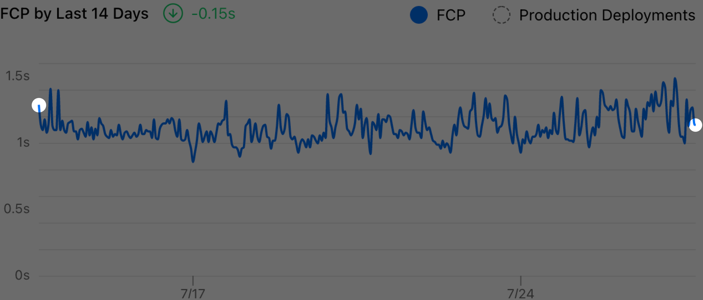
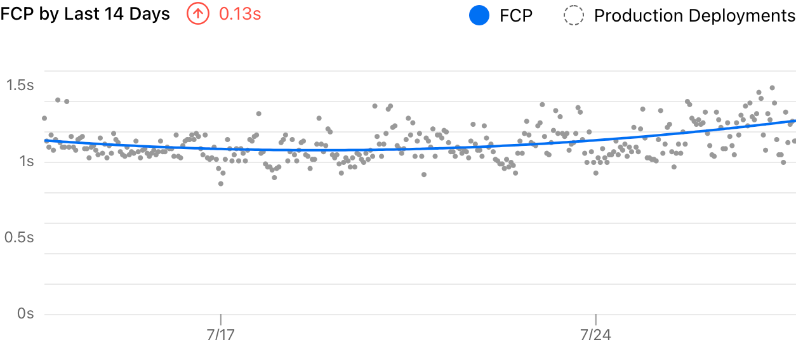

Last month I worked on a side project internally during Vercel’s “Design Your Friday” (do whatever you want on every month’s first Friday), to improve the data visualization of our [Analytics](https://vercel.com/analytics) charts. 

Vercel Analytics collects [web vitals](https://web.dev/vitals) data automatically from your website visitors, and shows you insights on the dashboard. Previously, we were visualizing all the data by simply plotting a line chart as the example shown below:

<figure></figure>

It’s a beautiful chart, but with a couple of problems noticed. As a developer, I’m intersted in how my website performs in the past weeks, and the prediction for the future.

But it’s hard to read the **trend** from the chart, because it’s too noisy: it seems to be increasing; However the indicator told me it has decreased by 0.15s, what’s wrong?

It turned out that in the chart, we just connect all the data points we sampled, and use the difference between the first and last one as the “trend”:

<figure style={{ border: 'none', background: '#6b6b6b' }}></figure>

That explains why it shows “-0.15”, apparently all the data points between that preiod were ignored. As long as the most recent data point shows a better result (could be one visitor with extremely good network connection), the chart will conclude that my website is performing well.

## Curve Fitting

Analyzing and finding the estimation of data points is a common but tricky problem. In our case, we are looking for a curve, that represents the overall trend of our data points of a time series, with as few noises as possible. That process is also called [curve fitting](https://en.wikipedia.org/wiki/Curve_fitting). 

To start, I built an example based on Philippe Rivière’s [notebook](https://observablehq.com/@fil/plot-regression). It uses the [**palmerpenguins**](https://allisonhorst.github.io/palmerpenguins) dataset to visualize the relationship between the [bill length and bill depth](https://allisonhorst.github.io/palmerpenguins/#bill-dimensions) of sampled penguins. It’s a bit noisy like our Analytics chart:

<iframe width="100%" height="476" frameBorder="0" style={{ maxHeight: 476, aspectRatio: '5/4', borderRadius: 3, backgroundColor: 'white' }} src="https://observablehq.com/embed/@shu/plot-regression?cells=RegressionLinear"></iframe>

There are many existing algorithms to calculate the fitting curve for a given set of data points, if you already know the type of the curve that you are looking for. The easiest way is to do a [linear regression](https://en.wikipedia.org/wiki/Linear_regression): finding a straight line to describe the data:

<iframe width="100%" height="591" frameBorder="0" style={{ borderRadius: 3, backgroundColor: 'white' }} src="https://observablehq.com/embed/@shu/plot-regression?cells=Regression%2Cviewof+param%2Cequation"></iframe>

Linear regression is just a special case of [**polynomial regression**](https://en.wikipedia.org/wiki/Polynomial_regression) where the order is 1. You can drag the slider above to see how different polynomial orders affect the fitting curve.

If **order** is N, the polynomial function will have a degree of N and the curve will have N-1 turning points (so 1 is a straight line).

The [**MSE (mean squared error)**](https://en.wikipedia.org/wiki/Mean_squared_error) value measures the goodness of the fit of the curve to the data, by definition it’s: **MSE = (value - predictedValue)2 / dataNum**. The smaller the error is, the better the curve describes the given data.

Usually, the easy solution would be manually choosing a reasonable order and hardcode it in our visualization. That’s what a lot of people do and in many cases it should be okay. However when we don’t know the behavior of the data (is it constantly increasing or decreasing? is it periodic?), it’s hard to choose a good order.

As you can already find out, a **higher order** will result in a more “accurate” curve with a **lower error** in general, but it also results in a more noisy curve because it can turn more times to follow our data, and our data has noises! This is called [**overfitting**](https://en.wikipedia.org/wiki/Overfitting).

You can play with the example below: it generates some fake data points with some normal distribution randomess, and calculates the regression curve with it. For the “Constant” data set, it’s better to just use a straight line to fit (**order = 1**). However, for “Quadratic” data, selecting **order = 2** will be way better.

<iframe width="100%" height="608" frameBorder="0" style={{ borderRadius: 3, backgroundColor: 'white' }} src="https://observablehq.com/embed/@shu/plot-regression?cells=RegressionLinear1%2Cviewof+rOrder%2Cviewof+rData%2Cviewof+rType"></iframe>

## The Good Fit

You might already got the general idea from the example above. A “bad fit”, or an “overfit” curve, might describe the **current** data set well, but when you regenrate the data, it will not describe the **new** data very well.

That is, a very foundational concept in Machine Learning and Data Science, to split the data into a **training set** and a **test set**. The training set (the **current** data) is used to train the model and calculate the regression curve, and the test set (**new** generated data) is used to evaluate how well the model works. A good fit should have a low error on the test set.

In our real-world problem, we don’t actually have a training set and a test set (we can’t generating these random data) and all we have are the numbers collected from our production. But we can just simply choose some data points and use them as the training set, and the remaining ones become the test set. To make the algorithm determinsitic, I just split our points by odd and even indexes.

<iframe width="100%" height="638" frameBorder="0" style={{ borderRadius: 3, backgroundColor: 'white' }} src="https://observablehq.com/embed/@shu/plot-regression?cells=Regression1%2Cviewof+orderT%2Cequation2"></iframe>

export const trainingSet = 
export const testSet = 

As shown in the example above, we use the {trainingSet} **training set** to calculate the fitting curve, and measure the error for both {trainingSet} **training set** and {testSet} **test set**. If you increase the order, the curve tries to follow the {trainingSet} points, but the gray lines show the error for {testSet} points.

Ideally a good fit should have a low error for both sets, as it shouldn’t be overfitting only the training set. Hence we use a simple but intuitive equation **error = max(MSE(training set), MSE(test set))** to measure the “overall goodness” of the fit for the entire data set. Usually when we increase the order of the polynomial regression, the error will decrease (underfitting), hit a good fit, then increase again (overfitting).

<iframe width="100%" height="476" frameBorder="0" style={{ borderRadius: 3, backgroundColor: 'white' }} src="https://observablehq.com/embed/@shu/plot-regression?cells=error"></iframe>

The chart above demonstrates the overall error “**max(MSE(training set), MSE(test set))**” when the polynomial regression order increases. It’s clear that when the order is 2, we have the best fit for the entire data which is what we can feel intuitively from the interactive example.

Finally, we can use that regression curve for the actual visualization and estimation. This adaptive approach is very simple, easy to implement, and turned out to be working really well for our problem. Here’s a before/after comparison of the visualization:

<figure></figure>

<figure></figure>

The delta (+0.13s) is much more accurate now, and the curve clearly shows the trend of the data. Meanwhile the exact data points are still presented to indicate the actual distribution.

Read about this product change in our [changelog](https://vercel.com/changelog/improved-accuracy-for-vercel-analytics-charts) and follow other updates!

## Appendix: Future Improvements

While this already solved our problem, I still found many other opportunities to further improve it when I was doing the research. One idea is to switch to [Locally Estimated Scatterplot Smoothing (LOESS)](https://en.wikipedia.org/wiki/Local_regression#:~:text=Local%20regression%20or%20local%20polynomial,moving%20average%20and%20polynomial%20regression.) with a large bandwidth instead of polynomial regression, because it is “local”: website performance will unlikely to continue grow in a “prediected direction” unless a change has been made, it will instead be mostly stable.

But at the end of the day, I believe that we need more time and experiments to make that decision since there is no single solution to all problems.
